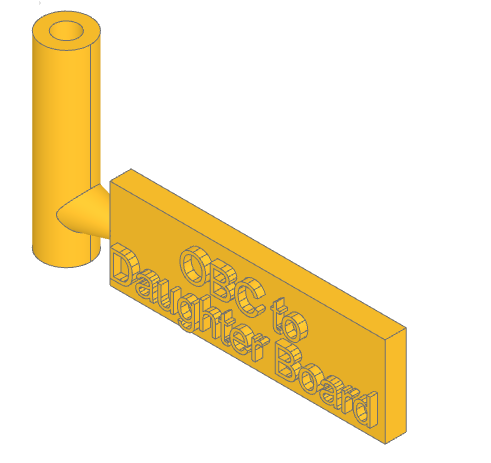

# Parametric-Labelled-Bushings-CAD

CAD for parametric labelled bushings (tubes, with a label flag off the side), built with build123d

## Usage

1. Modify the json file in the root, or use it as a template/sample.
2. Run the Python script. Optionally, specify the path to a json file as a CLI argument.

## Preview

```json
[
    {
        "text_top": "OBC",
        "text_bottom": "Daughter Board",
        "bushing_length": 25
    }
]
```


